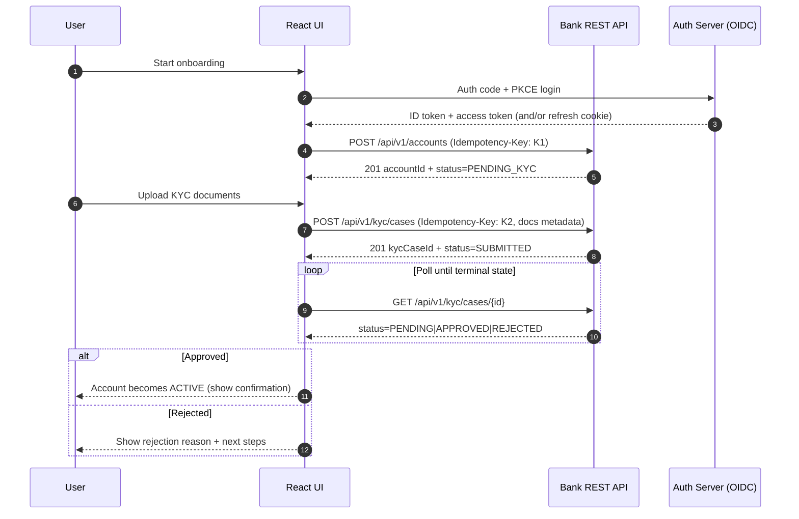
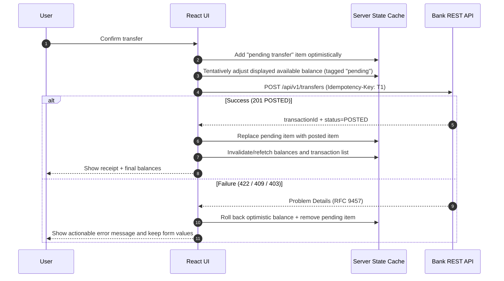
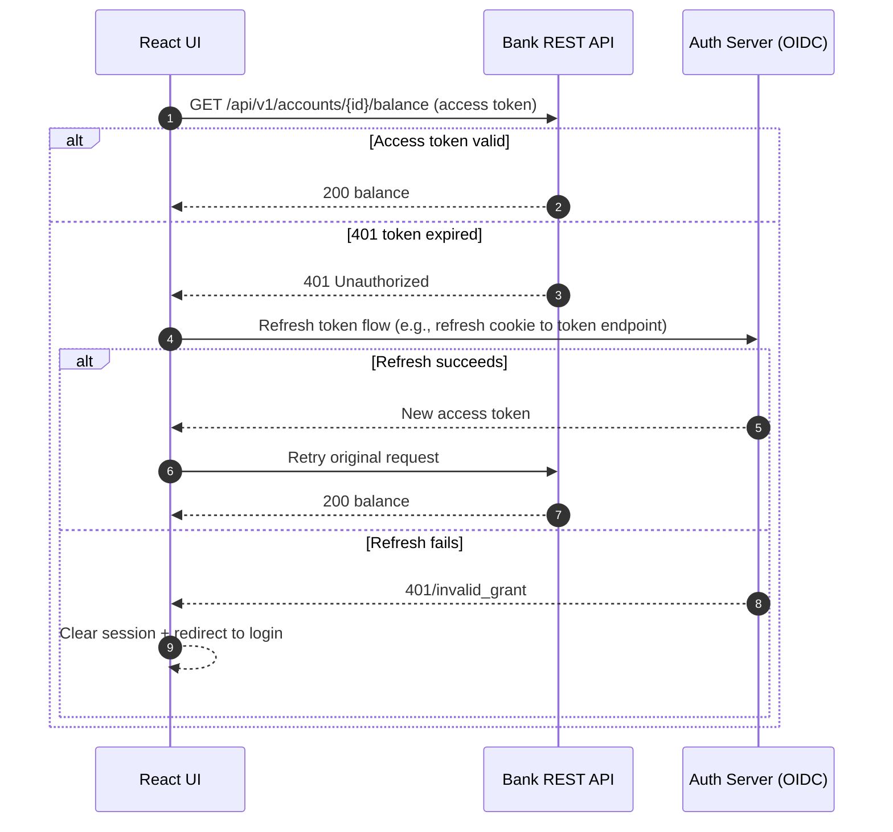

# React Frontend Plan for a Java Bank Server

## Executive summary

This report defines a four‑week plan to design and ship a distinctive React-based web UI that consumes the REST API of your Java bank server (layered backend with KYC-gated account lifecycle, ledger-backed transactions, idempotency, and RFC 9457 Problem Details error responses). It emphasises **bank-grade correctness in the UI**, meaning: (a) the interface never implies finality when the backend has not posted a transaction, (b) it treats “available vs ledger balance” (holds) as first-class UX, and (c) it is resilient to retries, double-submits, timeouts, and flaky networks via **Idempotency-Key** usage and deterministic client-side reconciliation. The plan aligns to modern React build guidance (use a contemporary build tool rather than Create React App), and explicitly budgets time for accessibility conformance (WCAG 2.1 AA), security hardening (XSS/CSRF/cookie/token storage), and production readiness (telemetry, error monitoring, performance, CI/CD). citeturn5search9turn0search8turn8search0turn8search1turn0search3

Key recommendations (high impact, low regret):

- **Architecture**: a route-based SPA (React + Vite) with a “ledger-first” design system and a clear separation between **UI state** and **server state**. React explicitly suggests choosing a build tool such as Vite when building a React app from scratch, and the React team has announced sunsetting Create React App, making it a poor default choice for a new product. citeturn5search9turn0search8turn5search1  
- **Server state**: treat backend resources (accounts, balances, ledger entries, KYC case status, scheduled payments) as **server state** managed by either TanStack Query (React Query) or Redux Toolkit + RTK Query. Both have first-class patterns for caching and optimistic updates; your choice should follow whether you want a unified Redux store or a smaller footprint focused on server-state. citeturn0search5turn0search2turn0search1  
- **Reliability**: adopt **Idempotency-Key** on all non-idempotent operations from the UI (account creation, KYC submission, transfers, withdrawals, deposits, closure, scheduled payments). The IETF draft defines Idempotency-Key as a mechanism to make POST/PATCH fault-tolerant. citeturn8search0  
- **Errors**: standardise client error parsing around **RFC 9457 Problem Details** and map errors to user-facing guidance and form fields. citeturn8search1  
- **Security**: assume the UI is an attack surface. Use React’s safe-by-default escaping (and avoid `dangerouslySetInnerHTML`), enforce CSP headers as defence-in-depth, and avoid storing sensitive tokens/PII in browser storage. OWASP and MDN both highlight browser storage risks and cookie hardening practices. citeturn7search0turn7search1turn9search3turn12search4  
- **Accessibility**: target WCAG 2.1 AA as requested, using W3C normative criteria plus WAI-ARIA Authoring Practices to avoid “bad ARIA”. citeturn0search3turn3search36  

## UX and product scope mapped to backend user stories

A banking UI succeeds when it makes account state **explainable**. The backend you described has critical concepts that must be surfaced explicitly: KYC gating, account lifecycle states, “available vs ledger” balances (holds), posted vs pending transactions, and stable statement outputs. A UI that hides these concepts will cause user distrust and operational support load (tickets like “why did my balance change?”).

### UX principle: “ledger-first” experience

A differentiating, “unique” UI can be built around a **ledger timeline** pattern:

- Every change to money is represented as an entry in a timeline (posted transaction, hold placed/released, fee assessed, interest posted).
- Each entry is expandable to show:
  - who initiated it (customer/teller/system),
  - its posting status (pending → posted),
  - any hold/availability impacts,
  - an audit reference (transaction ID, correlation ID),
  - and actionable next steps if it failed.

This maps naturally to your backend’s audit and ledger design and reduces ambiguity in high-stakes operations.

image_group{"layout":"carousel","aspect_ratio":"16:9","query":["mobile banking app dashboard UI","KYC onboarding flow user interface","bank transfer confirmation screen UI","bank account statement UI"],"num_per_query":1}

### Key user journeys and backend mapping

Below is an operationally complete scope for a first month, with customer-facing and admin/compliance views.

**Customer journeys**
- Account opening + KYC
  - Create profile, open account (status may be PENDING_KYC), submit KYC documents, track status updates.
- Dashboard + balance view
  - Show ledger balance, available balance, active holds, and “recent activity”.
- Transfer
  - Create a transfer, show immediate “pending” state, finalise on POSTED, rollback on failures, support receipt download/share.
- Scheduled payments
  - Create/edit/cancel scheduled internal transfers; show next run time and recent executions.
- Statements
  - Filter by date range; download statement; view transaction list.
- Notifications
  - In-app notifications centre; optional email/SMS settings if available.
- Account closure
  - Request closure; show blockers (non-zero balance, active holds).

**Teller/admin journeys**
- Deposit/withdrawal
  - Operational screens with strong validation, customer/account lookup, receipt printing.
- Admin: customer support operations
  - Place/release holds, apply fee waivers (if policy allows), view audit trail references.

**Compliance journeys**
- KYC review
  - Review submitted cases, approve/reject with reasons, request additional info, audit logging.

The plan assumes endpoints similar to those in your backend design (e.g., `/api/v1/accounts`, `/api/v1/kyc/cases`, `/api/v1/transfers`), and assumes error responses use RFC 9457 Problem Details. citeturn8search1  

## Component architecture and state/data strategy

### Page-model and component hierarchy

A pragmatic, scalable structure for this product is:

- **Pages (route-level)**: orchestrate data fetch + layout, minimal logic.
- **Containers/feature modules**: compose UI blocks for a feature (Transfers, Statements, KYC).
- **Atomic / shared components**: buttons, inputs, modals, tables, toasts, badges.
- **Domain components**: MoneyInput, AccountPicker, TransactionTimeline, HoldSummary, KycUploader.

This style aligns with React’s component model and also fits “component-driven development” (CDD) workflows (build components bottom-up, then assemble screens), which Storybook explicitly teaches. citeturn0search24turn10search0turn10search4  

### Component inventory mapping pages to components and API endpoints

This table is intentionally “implementable”: it can be turned into a sprint board.

| Page / route | Primary UI tasks | Core components (examples) | API endpoints consumed |
|---|---|---|---|
| `/onboarding/start` | Start onboarding, select account type, consent | `Stepper`, `Card`, `ProductSelector`, `ConsentCheckboxes` | (optional) `GET /api/v1/account-types` |
| `/onboarding/account` | Open account (idempotent) | `AccountOpenForm`, `MoneyInput`, `InlineValidation`, `SubmitWithIdempotency` | `POST /api/v1/accounts` |
| `/onboarding/kyc` | Upload docs, submit KYC, status tracking | `KycDocUploader`, `FileDropzone`, `KycStatusBadge`, `RetryPanel` | `POST /api/v1/kyc/cases`, `GET /api/v1/kyc/cases/{id}` |
| `/dashboard` | Overview balances, holds, recent timeline | `BalanceCard`, `HoldSummary`, `TransactionTimeline`, `Skeletons` | `GET /api/v1/accounts/{id}/balance`, `GET /api/v1/accounts/{id}`, `GET /api/v1/transactions?...` |
| `/accounts/:id` | Account details + activity | `AccountHeader`, `Tabs`, `TransactionTable`, `HoldList` | `GET /api/v1/accounts/{id}`, `GET /api/v1/accounts/{id}/balance`, `GET /api/v1/accounts/{id}/statements` |
| `/transfer` | Create transfer with optimistic UI | `AccountPicker`, `BeneficiaryPicker`(internal), `MoneyInput`, `FeePreview`, `TransferReviewModal` | `POST /api/v1/transfers`, `GET /api/v1/accounts/{id}/balance` |
| `/scheduled-payments` | CRUD scheduled payments, show executions | `ScheduleBuilder`, `ScheduledPaymentTable`, `NextRunBadge` | `GET/POST/PATCH /api/v1/scheduled-payments` |
| `/statements` | Filter + download | `DateRangePicker`, `StatementList`, `DownloadButton` | `GET /api/v1/accounts/{id}/statements` |
| `/notifications` | View + mark read | `NotificationList`, `FilterChips` | `GET /api/v1/notifications`, `PATCH /api/v1/notifications/{id}` |
| `/closure` | Closure request + blockers | `ClosureChecklist`, `Callout`, `ConfirmModal` | `POST /api/v1/accounts/{id}/closure-requests`, `GET /api/v1/accounts/{id}/balance` |
| `/admin/teller/cash` | Deposit / withdraw | `CustomerLookup`, `AccountLookup`, `MoneyInput`, `ReceiptView` | `POST /api/v1/deposits`, `POST /api/v1/withdrawals` |
| `/admin/compliance/kyc` | Review KYC cases | `KycQueueTable`, `KycCaseViewer`, `DecisionForm` | `GET /api/v1/kyc/cases?status=...`, `PATCH /api/v1/kyc/cases/{id}/decision` |

If the backend ultimately uses slightly different paths, generate this table from OpenAPI later (see OpenAPI-driven client generation below). The OpenAPI Specification exists specifically to describe HTTP APIs in a language-agnostic way so clients and tools can “discover and understand” endpoints and schemas. citeturn5search6turn5search2  

### State management options comparison

For a banking UI, the most expensive bugs are stale or inconsistent **server state** (balances, holds, transaction statuses). That suggests adopting a dedicated server-state library, or RTK Query which merges the concept into Redux.

| Option | Best for | Pros | Cons | Recommended use in this bank UI |
|---|---|---|---|---|
| React local state + Context | Small apps, low server complexity | Minimal deps; easy for UI state | Weak patterns for caching, retries, invalidation; can become ad hoc | Use for UI-only state: theme, locale, feature flags, non-sensitive session metadata |
| Redux Toolkit + RTK Query | One-store architecture + strong API layer | RTK Query is designed to simplify data fetching/caching; cache behaviour and invalidation are first-class. citeturn0search5turn0search13 | Adds Redux as foundational dependency; more setup than Query-only | Strong option if you want a single global “bank UI state” model (roles, toasts, navigation) plus API caching |
| TanStack Query (React Query) | Server-state heavy apps | Excellent caching, retries (incl. exponential backoff), optimistic update patterns. citeturn8search3turn0search2 | Not a general global state store; still need something for app state | Strong default if you want “server state” clearly separated from UI state |
| Hybrid: TanStack Query + lightweight global store | Large apps with clear state boundaries | Clean separation; fewer global state smells | Requires discipline; 2 mental models | Recommended pattern: TanStack Query for server state; Context (or small store) for UI/session |

Because bank flows are dominated by server state (balances, KYC status, transaction lifecycle), a **hybrid** approach is typically the most maintainable: TanStack Query for server state + minimal Context for session/UI. TanStack Query documents both optimistic updates and retry/backoff behaviour; these map directly to transfer UX and resilience design. citeturn0search2turn8search3  

### Data fetching, caching, and invalidation strategy

A bank UI needs both freshness and stability:

- **Balances**: treat as freshness-sensitive; keep `staleTime` low and refetch on focus (or during active flows like transfers). If you hide holds and only show one balance, users will get surprised; show ledger vs available explicitly and state “as of” timestamps where possible.
- **Transactions/statement lists**: treat as stable but paginated; cache pages; allow background refresh.
- **KYC status**: poll with backoff when a case is in a transitional state, or use server push later.
- **Notifications**: poll or fetch on interval; mark-read operations can be optimistic.

If you choose TanStack Query, the built-in retry/backoff defaults and configurable retry delay are documented; by default it applies backoff delays to retries. citeturn8search3  
If you choose RTK Query, cache behaviour and error handling are explicitly documented and should be used instead of hand-written “fetch in useEffect” patterns. citeturn0search13turn8search2  

## Client reliability: optimistic updates, idempotency, and error reconciliation

### Optimistic updates: when and how (especially transfers)

Banking UX benefits from “optimistic” affordances (snappy UI), but you must avoid implying a transfer is final before the backend posts it.

A safe banking approach is **optimistic UI, pessimistic ledger**:

- Immediately add a **“pending transfer”** entry in the timeline and (optionally) show a “projected available balance” as tentative.
- Never mutate the “posted” ledger list until the server confirms POSTED.
- On failure, rollback the pending item and show a meaningful Problem Details message.

TanStack Query documents patterns for optimistic updates (e.g., `onMutate` with rollback). citeturn0search2  
RTK Query documents manual cache updates to implement optimistic or pessimistic updates via `api.utils.updateQueryData`. citeturn0search1  

### Idempotency on the client: generating and using Idempotency-Key correctly

The frontend must assume:
- “Submit” can be clicked twice,
- mobile networks drop responses,
- users refresh pages mid-flight,
- and browsers retry requests in some scenarios.

The IETF draft defines `Idempotency-Key` for making POST/PATCH fault-tolerant. citeturn8search0  

**Client rules that prevent duplicate money movement**
- Generate an idempotency key **once per “intent”**:
  - For transfers: once per confirmation click (not per render).
  - For account opening: once per final submit on the “review” step.
  - For KYC submission: once per “final submit”; uploads may have separate keys.
- Persist the in-flight idempotency key and request fingerprint in memory (and optionally in sessionStorage if you must survive refresh), but do **not** persist sensitive payloads long-term.
- If the user retries the same intent (same payload), reuse the same key and show “resuming previous submission”.
- If the payload changes materially, create a new key and treat it as a new intent.

MDN notes that session storage is scoped to a tab and lasts only for the page session, making it less persistent than localStorage; OWASP emphasises that browser storage should not be treated as a secure place for sensitive data, particularly when XSS is in play. citeturn9search7turn1search2  

### Error reconciliation: Problem Details mapping to UI

Adopt RFC 9457 as the universal error contract. RFC 9457 defines a standard “problem detail” JSON shape for machine-readable HTTP API errors, obsoleting RFC 7807. citeturn8search1  

Practical mapping strategy:
- If the response is `application/problem+json`, parse:
  - `title`, `detail`, `status`, `type`
- Use `type` as the stable discriminator for UI behaviour:
  - e.g., `.../insufficient-funds` → show “Add funds / reduce amount”
  - `.../kyc-required` → deep link to KYC step
  - `.../account-frozen` → show compliance messaging
- For form validation:
  - standardise backend to return a field error map in an extensions member (e.g., `errors: { field: [messages] }`)
  - map field errors to input components and summary banners

This avoids client-side string matching and makes behaviour robust when wording changes.

## Authentication/authorisation, accessibility, i18n, money formatting, and frontend security

### OAuth2/OIDC login and token refresh flow

Use **OAuth 2.0** + **OpenID Connect**:
- OAuth 2.0 defines the authorisation framework for obtaining limited access to HTTP services. citeturn9search0  
- OpenID Connect adds an identity layer; its authorisation code flow explicitly avoids exposing tokens to the user agent and supports exchanging the code for tokens securely. citeturn2search3  

For SPAs, use:
- **Authorisation Code Flow + PKCE**. PKCE mitigates authorisation code interception attacks for public clients. citeturn9search1turn2search0  
- Follow OAuth security best current practice (RFC 9700), which updates the threat model and deprecates insecure modes of operation. citeturn2search0  

#### Token storage options comparison (frontend threat model)

MDN’s session management guidance explains that token storage considerations are similar to session IDs, and many sites choose HttpOnly cookies to protect against client-side XSS. citeturn9search3  
OWASP’s HTML5 and session management guidance warns against treating browser storage as safe for sensitive information, especially because XSS can access it. citeturn1search2turn7search2  
OWASP ASVS includes a requirement to verify that data stored in browser storage does not contain sensitive data or PII. citeturn12search4  

| Storage approach | XSS resistance | CSRF exposure | UX | Operational notes | Recommended for this bank UI |
|---|---|---|---|---|---|
| Access token in `localStorage` | Weak (XSS can read) | Lower CSRF risk | Survives refresh | High risk for bank-grade apps | Avoid (unless threat model is low and CSP/Trusted Types are strong) citeturn1search2turn12search4 |
| Access token in memory (JS variable) | Better (not persistent) | Lower CSRF risk | Lost on refresh | Requires refresh strategy (silent reauth / refresh token) | Good for access tokens when you have refresh tokens/cookies |
| Refresh token in HttpOnly cookie + access token in memory | Stronger vs XSS for refresh token (HttpOnly) | Needs CSRF mitigation | Smooth, can silently refresh | Cookie size limits; cross-site cookie policies; requires backend support | Best “bank-grade” default when backend can issue refresh cookies citeturn9search3turn7search2turn7search6 |
| All tokens in HttpOnly cookies | Strong vs XSS | Higher CSRF exposure | Smooth | Must apply CSRF mitigations (tokens, Origin checks, SameSite) | Good if backend has robust CSRF defences citeturn7search6turn1search1 |

**CSRF**: if you use cookies for auth, implement server-side CSRF defences. OWASP’s CSRF prevention guidance recommends using built-in framework protections or CSRF tokens for state-changing requests and treats SameSite as defence-in-depth rather than a complete solution. citeturn1search1turn7search6  

### Role-based UI vs server authorisation

The UI should:
- hide or disable actions not allowed for a role (customer vs teller vs compliance),
- but **never** rely on UI gating as a security mechanism.

This is consistent with OWASP API Security risks (e.g., broken authorisation). The backend must enforce authorisation; the UI’s role-based rendering is a usability feature.

Implementation approach:
- Decode role claims from the ID token (OIDC) or fetch `GET /me` from the API.
- Use `RoleGuard` components and route guards.
- Keep “authoritative” action availability driven by server responses:
  - if server returns 403 or `type=.../forbidden`, the UI reconciles and updates capability flags.

### Accessibility: WCAG 2.1 AA and ARIA discipline

WCAG 2.1 is a W3C standard with testable success criteria for accessibility across a wide range of disabilities. citeturn0search3  
W3C notes WCAG 2.2 is backwards compatible with WCAG 2.1 (meeting 2.2 implies meeting 2.1), but if your requirement is WCAG 2.1 AA, you can still use the latest W3C resources for implementation guidance. citeturn0search7  

Core implementation checklist (banking-specific):
- **Forms**: label association, error summaries, and clear programmatic announcements for validation errors.
- **Focus management**: on route change, move focus to the page heading; on modal open/close, focus trap and restore.
- **Tables (statements/transactions)**: accessible table semantics, keyboard sorting, screen reader-friendly captions.
- **Live regions**: use ARIA sparingly for transaction status updates.

The ARIA Authoring Practices guide warns that incorrect ARIA can be worse than none (“No ARIA is better than bad ARIA”), so prefer semantic HTML wherever possible. citeturn3search36turn3search0  

### Internationalisation (i18n) and locale management

Although your initial market and currencies are unspecified, you should architect for i18n now to avoid later rewrites:

- Enforce document language tags and content language metadata.
- Use BCP 47-compliant language tags; W3C provides best practices and examples (e.g., prefer short tags like `ja` unless region distinctions matter). citeturn1search7turn1search3  

Implementation approach:
- Store `locale` and `timeZone` in user preferences (server-side if possible).
- Use message catalogues per locale (e.g., `en-GB` as default).
- Make number/date formatting locale-aware, not string-concatenated.

### Money and currency display: minor units, formatting, rounding

Frontend money display must follow the backend’s numeric model:

- Treat amounts from the API as **minor units** (integer) to avoid floating-point drift.
- Use `Intl.NumberFormat` for locale-aware currency formatting. MDN documents currency formatting via `Intl.NumberFormat` options. citeturn6search1turn6search11  
- If your backend supports multiple currencies with different minor unit digits, you need a currency metadata map (e.g., digits per ISO 4217 currency) in the frontend; if currency support is unknown, plan for configuration-driven digits rather than hard-coding “2 decimals”.

Operational UX guidance:
- Display the currency code when ambiguity exists (e.g., “USD 1,234.56”).
- For holds, show: **Available** (ledger − holds − pending debits) vs **Ledger** (posted). This prevents “invisible money” confusion.

### Frontend security: XSS, CSP, clickjacking, and browser storage

**XSS**
- React warns that `dangerouslySetInnerHTML` should be used with extreme caution because untrusted HTML introduces XSS risk. citeturn7search0  
- OWASP’s XSS Prevention guidance emphasises framework protections, output encoding, and sanitisation as layered defence. citeturn1search0turn11search2  

Practical rules:
- Avoid `dangerouslySetInnerHTML` entirely for bank screens.
- If you must render rich text (e.g., CMS legal copy), sanitise on the server and apply a strict CSP.

**CSP (Content Security Policy)**
- MDN explains CSP as a set of restrictions delivered via headers to reduce XSS/clickjacking risk and can require Trusted Types for DOM XSS defences. citeturn3search1turn3search5  
- OWASP CSP guidance frames CSP as defence-in-depth against XSS. citeturn7search1  

**Clickjacking**
- OWASP provides a clickjacking defence cheat sheet, and MDN recommends setting `frame-ancestors` and/or `X-Frame-Options`. citeturn11search3turn11search19  

**Browser storage**
- OWASP ASVS explicitly calls for verifying sensitive data/PII is not stored in browser storage. citeturn12search4  
- Treat localStorage/sessionStorage/IndexedDB as inspectable by an attacker with local access or via XSS.

## Testing, performance, DX, deployment, and observability

### Testing strategy and tools comparison

Testing needs to cover:
- money-motion UX correctness (transfers, holds),
- auth/session edge cases,
- accessibility regressions,
- and browser/device compatibility.

| Layer | Tool options | What it proves | Why it fits this bank UI |
|---|---|---|---|
| Unit tests | Vitest or Jest | Pure functions: money formatting, field validation mapping, reducers | Vitest is designed to “just work” for Vite apps by reusing Vite pipelines. citeturn10search1 |
| Component/integration | Testing Library | User-centric component behaviour | Testing Library queries mirror how users find elements, improving confidence. citeturn6search2 |
| E2E | Playwright or Cypress | Full user journeys across browsers | Playwright runs across Chromium/Firefox/WebKit with “web-first” assertions and robust locator guidance. citeturn6search3turn6search7 |
| Visual regression | Storybook + Chromatic | UI styling regressions before merge | Storybook supports visual testing via Chromatic; every story becomes a test. citeturn10search7 |
| Accessibility testing | Axe (via Cypress/Playwright), manual audits | WCAG conformance | Combine automation + manual keyboard/screen reader checks |

### Performance and bundle optimisation

Key techniques:
- **Route-based code splitting** using `React.lazy` + `<Suspense>` for pages and heavy widgets (statement tables, admin queues). React documents that `lazy` loads component code and “suspends” during loading, with `<Suspense>` providing fallbacks. citeturn5search0turn5search4  
- Avoid “network waterfalls” caused by fetching after render; the React team highlights that naïve effect-based fetching can create waterfalls and that Create React App does not include a data fetching solution. citeturn0search8  
- Monitor Core Web Vitals (LCP, INP, CLS) thresholds as a user experience correctness signal; web.dev summarises the metrics and targets. citeturn11search0  

### Design system and theming (unique visual identity)

A “unique” bank UI should be systematic, not decorative:

- Define design tokens: colour, typography, spacing, elevation, motion, and data-visualisation styles (transaction timelines, badges).
- Provide **dark mode** and respect user preference using `prefers-color-scheme`. MDN documents `prefers-color-scheme` for detecting light/dark user preferences. citeturn11search1  
- Use Storybook for component-driven development and documentation; Storybook explicitly positions itself as a workshop to build, test, and document components in isolation. citeturn10search4turn10search8  

Uniqueness ideas that reinforce trust (not just aesthetics):
- “Ledger line” motif: consistent alignment and “posting markers” for timeline events.
- “Explainability drawers”: every monetary event has a “Why did this happen?” drawer with transparent breakdown (fees, holds, effective dates).
- “State chips” that encode lifecycle: PENDING_KYC, ACTIVE, FROZEN, CLOSING.

### Offline/resilience and service workers

Use offline features carefully in banking because offline “writes” can create false confidence.

Baseline:
- Cache static assets for faster repeat visits (“offline-first shell”).
- MDN explains service workers can provide an offline-first experience but require HTTPS and act as a proxy over requests/responses. citeturn4search0  

Advanced (optional) for month 1:
- Cache read-only data (recent transactions) with clear “may be stale” banners.
- Avoid offline submission of transfers by default.

Background Sync:
- MDN describes the Background Synchronisation API but flags it as **experimental** and notes limited availability. citeturn4search1turn4search21  
If you implement it, limit to low-risk operations (e.g., uploading documents metadata, marking notifications read) rather than money movement.

### OpenAPI-driven client generation and contract alignment

Treat OpenAPI as the source of truth for:
- DTO types,
- endpoints,
- response media types (`application/problem+json`),
- and security schemes.

The OpenAPI Specification defines a standard, language-agnostic interface description for HTTP APIs enabling consumers and tools to understand and interact with services with minimal guesswork. citeturn5search6turn5search2  

Implementation pattern:
- Backend publishes OpenAPI.
- Frontend generates a TypeScript client:
  - OpenAPI Generator provides stable TypeScript client generators such as `typescript-axios` and `typescript-fetch`. citeturn5search3turn5search7  
- Use generated types in query/mutation hooks.
- Add contract tests that validate the UI works against a mock server built from OpenAPI examples.

### Telemetry, error monitoring, and observability

Bank UI failures must be diagnosable without leaking sensitive data:

- Use OpenTelemetry for browser traces and correlation; OpenTelemetry JS docs describe browser tracing packages. citeturn4search6turn4search2  
- Use Sentry for error + performance monitoring; Sentry provides React guides and performance monitoring docs. citeturn4search19turn4search7  
- Correlate frontend events with backend correlation IDs:
  - capture `x-correlation-id` response headers (if backend emits),
  - attach as a span attribute and include in error reports.
- Redaction: never log full account numbers, tokens, or PII.

### Deployment and hosting options

For a React SPA, static hosting is commonly sufficient:

- Vercel supports deployments via CLI and integrates with Git for previews; it also supports Vite projects directly. citeturn12search2turn13search2  
- Netlify supports SPA routing via redirects/rewrites and has dedicated documentation for redirect rules. citeturn13search5  
- AWS Amplify offers a Git-based CI/CD workflow to build and host single-page apps and static sites. citeturn13search0turn13search12  

Choose based on:
- preview environments (important for product owner iteration),
- custom headers support (CSP/security headers),
- and organisational constraints (AWS-first vs vendor-neutral).

## Four-week execution timeline aligned to the backend plan

This schedule assumes you are implementing the frontend while the backend is built in parallel; the critical path is the API contract (OpenAPI + Problem Details + Idempotency-Key behaviour). The plan deliberately produces a usable onboarding/dashboard slice early, then hardens money movement and admin flows, and finishes with testing/observability/deployment.

### Week one: foundation, contract, and design system

**Milestones**
- Confirm API contract primitives:
  - Problem Details `application/problem+json` parsing (RFC 9457). citeturn8search1  
  - Idempotency-Key header usage (IETF draft). citeturn8search0  
- Frontend scaffolding with Vite + TypeScript (recommended by React guidance to pick a build tool like Vite). citeturn5search9turn5search1  
- Storybook setup for tokenised design system (CDD). citeturn10search0  

**Deliverables**
- Repo structure + linting + formatting + CI.
- Design tokens v1 (colour/typography/spacing), dark mode baseline (prefers-color-scheme). citeturn11search1  
- Component library starter set in Storybook: Button, Input, Select, Modal, Toast, Badge, Skeleton.

**Estimated effort (solo)**
- ~4–6 days.

**Risks + mitigations**
- Risk: backend endpoints drift → mitigate by generating client from OpenAPI early and updating via CI checks. citeturn5search6turn5search3  

### Week two: onboarding + KYC + auth scaffolding

**Milestones**
- OAuth2/OIDC integration with code flow + PKCE. citeturn2search3turn9search1turn2search0  
- Implement account opening wizard + KYC upload UI with idempotent submission.

**Deliverables**
- Pages: onboarding start, open account, KYC upload, KYC status tracking.
- Auth session model and role extraction (customer/teller/compliance).
- Error mapping from Problem Details to inputs/summaries.

**Estimated effort**
- ~5–7 days.

**Risks + mitigations**
- Risk: token storage insecurity → choose HttpOnly cookie approach if possible; avoid localStorage for sensitive tokens. citeturn9search3turn1search2turn12search4  

### Week three: dashboard + transfers + statements core

**Milestones**
- Core customer dashboard with explicit available vs ledger balances and holds.
- Transfer experience with optimistic UI + rollback + idempotency key reuse.
- Statements list + filtering (download stub if PDFs aren’t ready).

**Deliverables**
- Dashboard, account details, transfer flow, transaction timeline/table.
- Server-state layer fully implemented (TanStack Query or RTK Query), including retries/backoff where appropriate. citeturn8search3turn0search5turn8search2  
- Accessibility pass on critical flows (keyboard-only and screen reader smoke tests) against WCAG 2.1 criteria. citeturn0search3  

**Estimated effort**
- ~6–8 days.

**Risks + mitigations**
- Risk: optimistic update creates misleading “final” state → enforce “pending vs posted” visual language and never merge into posted ledger until confirmed. citeturn0search2  

### Week four: admin/compliance flows + observability + hardening + release

**Milestones**
- Teller deposit/withdraw UI and compliance KYC review queue.
- Notifications centre.
- Observability + performance monitoring + deployment pipeline.

**Deliverables**
- Admin routes with RoleGuard.
- OpenTelemetry browser traces + Sentry error/perf monitoring. citeturn4search6turn4search19turn4search7  
- E2E tests for:
  - onboarding,
  - transfer success/failure,
  - KYC review approve/reject,
  - auth refresh expiry handling.
- Visual regression tests in Storybook + Chromatic. citeturn10search7  
- Deployment configured (Vercel/Netlify/AWS Amplify). citeturn12search2turn13search0turn13search5  

**Estimated effort**
- ~6–8 days.

**Risks + mitigations**
- Risk: security headers/CSP misconfigurations → follow OWASP CSP/security header guidance and test via staging; CSP is defence-in-depth, not a substitute for safe coding. citeturn7search1turn7search17turn3search1  

## Key flow diagrams (Mermaid)

### Account opening with KYC upload and idempotency

### Transfer flow with optimistic update and rollback

### Auth token refresh (silent refresh)

